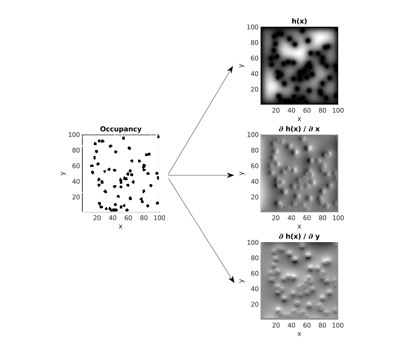

# Poisson-Safety-Boundary-Determiner

Poisson Safety Boundary Determiner - ml based supervised model



## Artificial Data Generation

Directory *matlab* contains scripts which:

- generates set of maps with randomly located circular obstacles (obstacles
can be separated or occluded),
- generates based on them Poisson Safety Function with derivatives over *x*
and *y*,
- saves results to **.h5* file.

This scripts can be run directly in malab or there can be used Docker file for
run it with MCR (MATLAB Compiler Runtime) - with compiled version of script, so
no MATLAB license is needed.

### Docker

To run generation with MCR you can use docker with follwing commands:

#### Build

```console
docker build -t mcr_data_generation .
```

#### Run

Run with 2 arguments:

- output file name,
- number of grids generated.

```console
docker run --rm mcr_data_generation output_file_name.h5 1000
```

### RUN inside docker

export LD_LIBRARY_PATH=$LD_LIBRARY_PATH:/opt/mcr/R2024b/bin/glnxa64/:/opt/mcr/R2024b/runtime/glnxa64/

### my fixes -> 
apt-get install libglew-dev

### existing error still ->  
root@7d93a4766567:/workspaces/Poisson-Safety-Boundary-Determiner# ./matlab/generate_maps_and_psf output.h5 100
PostVMInit failed to initialize com.mathworks.mwswing.MJStartupForDesktop
PostVMInit failed to initialize com.mathworks.mwswing.MJStartup
Could not find java/awt/Component

Error in javaclasspath

Error in javaclasspath

Error in javaaddpath (line 69)

MATLAB:Java:GenericException