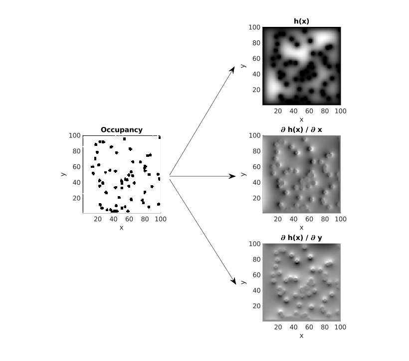
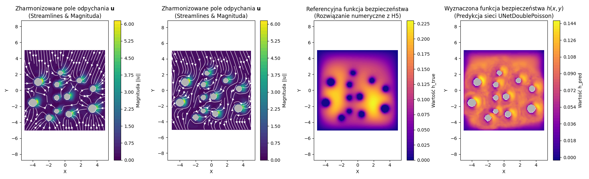
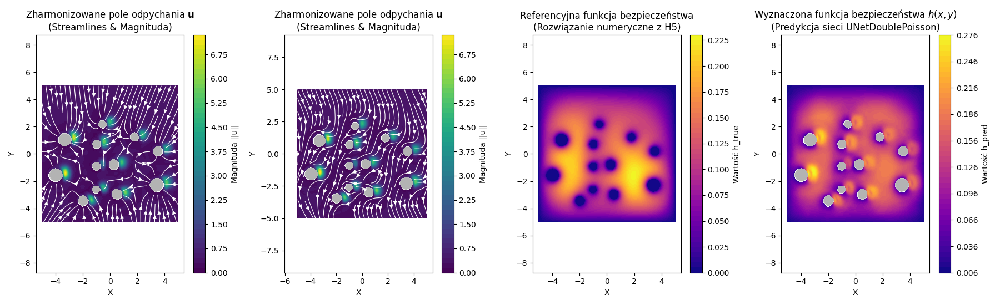
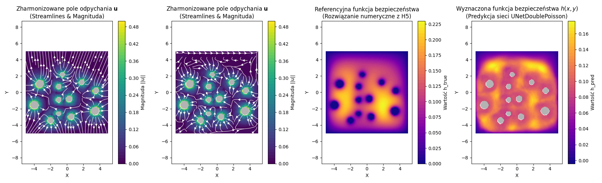
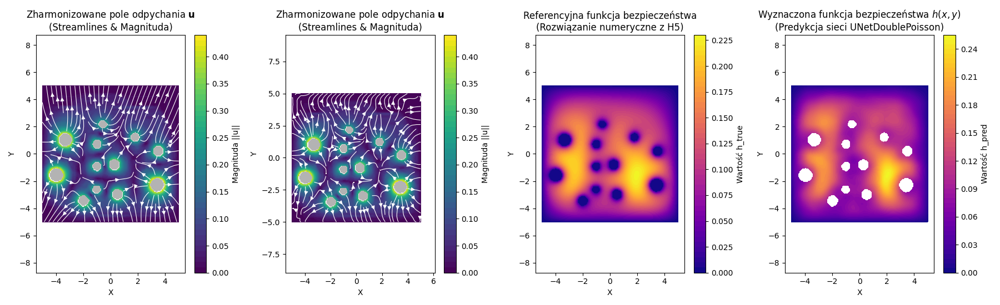

# Poisson Safety Boundary Determiner

Tools for generating Poisson safety-function datasets and training or running
neural-network models on occupancy grids.



## Features

- Generate obstacle maps and reference fields with a Python finite-difference
  solver.
- Train a `UNetDoublePoisson` model.
- Run inference on HDF5 occupancy-grid datasets.
- Explore the separate C++ solver described in [`cpp/README.md`](cpp/README.md).

## Setup

Install the Python dependencies:

```bash
pip install -r requirements.txt
```

The pinned dependencies include CUDA-related packages. If installation fails
on your platform, install a PyTorch build appropriate for your system and
adjust the dependency list as needed.

## Generate training data

The Python generator creates obstacle maps and reference fields on a square
grid. For example, generate 500 maps at 512 × 512 resolution using four threads:

```bash
python generate_data.py data/training_data_512x512_500.h5 500 512 --num-threads 4
```

The HDF5 file contains the groups `grid`, `u_x`, `u_y`, `h`, `dhdx`, and `dhdy`.
Each sample is stored under a zero-padded numeric key. The generated fields
cover the domain `[-5, 5] × [-5, 5]`.

## Train a model

```bash
python train_pinn.py \
  --data_file data/training_data_512x512_500.h5 \
  --epochs_number 5 \
  --weights_path weights/model.pth
```

Training uses CUDA when available and otherwise runs on CPU. It saves the model
weights and normalization statistics alongside the configured weights path.

## Run inference

Use a trained checkpoint and its matching normalization statistics:

```bash
python run_inference.py \
  --data-path data/training_data_512x512_500.h5 \
  --weights-path weights/model_best.pth \
  --norm-stats-path weights/model_norm_stats.pt \
  --sample-index 0
```

Omit `--sample-index` to process all samples. Add `--cpu` to force CPU
inference or `--show` to display the plots. Prediction plots are saved in
`fig/`.

## Repository layout

- `generate_data.py` — Python dataset generator.
- `train_pinn.py` — model training.
- `run_inference.py` — inference and prediction plots.
- `data/` — HDF5 datasets.
- `models/` — model definitions.
- `weights/`, `results/release_weights/` — model weights and normalization data.
- `cpp/` — C++ solver and its instructions.
- `fig/` — example figures.

## Example results





